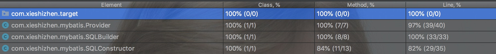

#### Description
````
Function libraries for development activities, to facilitate the simple and rapid
use of Mybatis, RabbitMQ, and so on in spring boot projects
````
---
## How to use
---
````
1. Go to releases, download the newest releases
2. import to your project
3. Sometimes it's a good habit to look at the source code， In order to 
   easily see the source code of this package in the development activity, 
   please download the corresponding version of the source code package in 
   the development tools for source binding. There are many such tutorials 
   on the Internet, I wish you happiness in your development.
````
---
#### Use with maven
---
````
1. Download the newest releases
2. Go to the directory where the downloaded package is located， add this package to your maven repository
   run： mvn install:install-file -Dfile=./xxx.jar -DgrouId= xx.xx.xx -Dartifact xx-xx-xx 
         -Dversion=x.x.x -Dpackaging=jar
   (X: You can fill in whatever you want, but it is recommended that you keep the same naming style as
   the maven package.)
3. Add dependency in your project pom.xml file, for example:(Dependency information needs to be named t
he same as what you imported into the Maven Library)
   <dependency>
        <groupId>xxx.xxx</groupId>
        <artifactId>xxx-xxx</artifactId>
        <version>x.x.x</version>
   </dependency>

````
---
## Notice
````
Welcome exchanges and refuse to slander or abuse
Email：1363215999@qq.com
You can contact me anytime if you have any suggestions or questions.
````
---
## Part of Mybatis
---
#### The part Of Mybatis code design is located in : 
###### [src/main/java/com.xieshizhen/mybatis](https://github.com/Kitetop/mybatis/tree/master/src/main/java/com/xieshizhen/mybatis)
#### The Unit test result


---
#### All the the core code of the design are located in：
###### [src/main/java/com.xieshizhen](https://github.com/Kitetop/mybatis/tree/master/src/main/java/com/xieshizhen)
---
